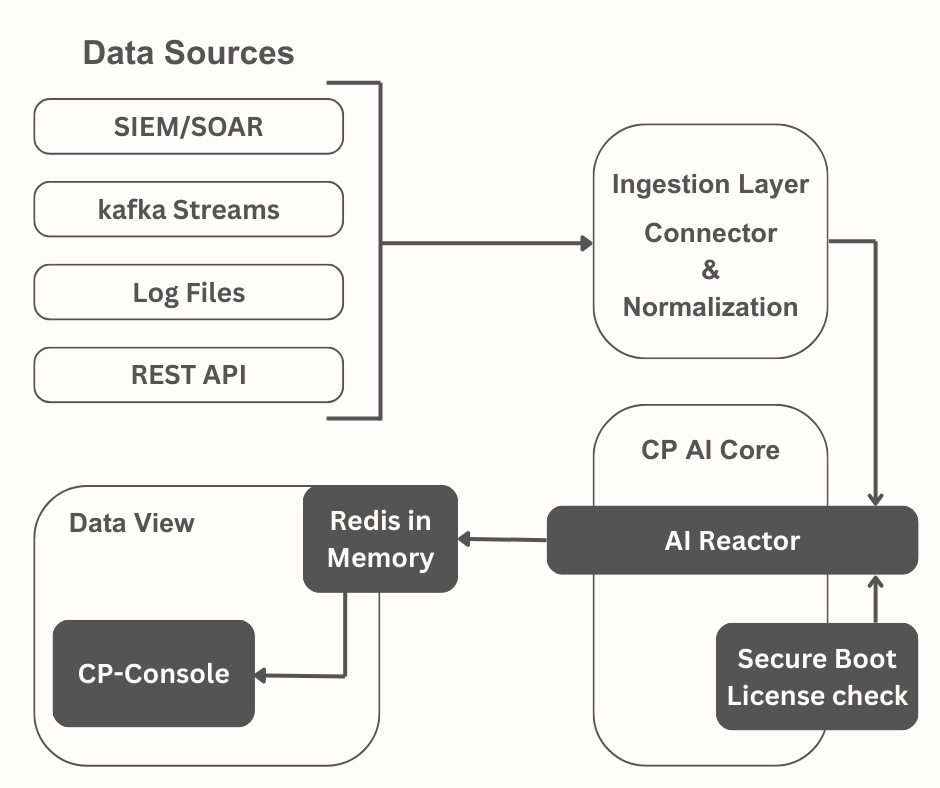

# Cyber-Physics: Kinetic Defense Engine (v2.2.0 Enterprise)



> **Stop Zero-Day attacks with Physics, not Signatures.**
> A deterministic, offline cyber-defense core based on differential momentum analysis.

[](https://hub.docker.com/)
[-red)](mailto:contact@tjdeed.com)
[]()

## Overview

**Cyber-Physics** is an Overlay Intelligence Layer that integrates with your existing SIEM/EDR stack. Unlike traditional AI that requires massive training data, Cyber-Physics uses **Kinetic Metrics** (Mass, Velocity, Momentum) to detect anomalies in real-time (O(1) complexity).

### Key Features
- **Zero-Day Detection:** No signatures required. Detects "movement," not "patterns."
- **100% Offline:** Fully dockerized, GDPR-compliant, and data sovereign.
- **Millisecond Response:** Processes streams instantly with minimal CPU overhead.
- **Universal Integration:** REST API compatible with Splunk, QRadar, and Sentinel.

---

## Downloads & Documentation

Before deploying, please review the technical documentation:

- **[Whitepaper: The Physics Paradigm](The_Physics_Paradigm_fo_RealTime_Cyber_Defense.pdf)** - *Technical deep dive.*
- **[Integration Guide (PDF)](CyberPhysics_Integration_Guide.pdf)** - *How to connect with SIEM/SOAR.*

---

## Quick Start (Trial Version)

You can deploy the defense core immediately using Docker.

### Prerequisites
- Docker & Docker Compose installed.
- 4GB RAM minimum.

### Deployment
Save the following as `docker-compose.yml` and run `docker compose up -d`:

```yaml
version: '3.8'
services:
  cp-core:
    image: cyberphysics/core-ee:v2.2.0  # (Coming soon to public hub)
    ports:
      - "8081:8081"
    environment:
      - LICENSE_KEY=DEMO-TRIAL-MODE
```

## Enterprise Contact
For licensing, PoC requests, and partnership inquiries:

Email: muntherkz2018@gmail.com


Region: Middle East / Europe / Asia

